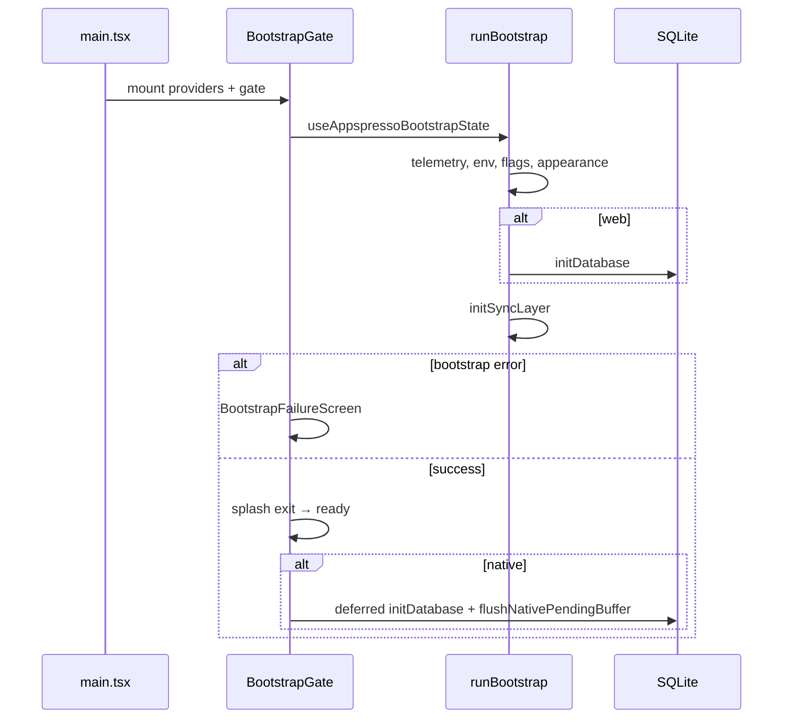

# Appspresso architecture (Foundation)

## Repository layout

| Area | Role |
|------|------|
| `src/app/` | Mount, router shell, bootstrap gate, providers |
| `src/services/` | Capacitor / platform side effects (no page imports) |
| `src/state/` | Single Jotai `appStore` + atoms |
| `src/sync/`, `src/db/` | Offline outbox + SQLite |
| `src/auth/` | Adapter pattern + `session-store` → HTTP Bearer |
| `src/pages/` | **Template/demo UI** — not core infrastructure |
| `dist-lib/` | Published ESM + types (`npm run build:lib`) |
| `demo/` | Workspace app consuming `file:..` |
| `packages/create-appspresso/` | Scaffold template (synced from demo) |

## Host vs full template

- **`bootAppspressoHost({ rootComponent })`** — minimal shell: providers, bootstrap gate, your router.
- **`bootAppspresso()`** — loads default `App` with built-in demo router and pages.

Production apps should use the host path and own routes; treat `appspresso/pages/*` and `appspresso/template/*` as **unstable starter UI** until a dedicated template package ships.

## Provider stack (outer → inner)

`QueryProvider` → `StoreProvider` → notifications → theme → toast → tooltip → filesystem → **Auth** → RevenueCat → i18n.

Use `AppspressoRootProviders` `omit` prop to drop optional layers.

## Bootstrap sequence

State: `bootstrapStatusAtom` (`idle` | `running` | `ready` | `failed`).

## Auth and HTTP

Adapters (`demo`, Firebase, Supabase, custom) emit auth UI state via `subscribe`. Production adapters must sync tokens through `syncHttpAccessToken` (Firebase ID token, Supabase `access_token`) so `api/http` sends `Authorization: Bearer`.

## Native sync

Until SQLite opens (~4s after first paint on native), mutations are held in an in-memory buffer and flushed via `flushNativePendingBuffer()` after `initDatabase`. Retry uses DB `attempts` (max 5).

## State

- **Jotai** — device, network, offline, sync, sqlite, bootstrap, feature flags.
- **TanStack Query** — server/cache (separate from Jotai).

## Capacitor capabilities

There is no Studio-style plugin registry. Each service lazy-loads plugins and exposes `isXAvailable()`. Capacitor config merges live in `appspresso.config.ts` → `build/project-config.ts`.

## Further reading

- [Core vs template](./core-vs-template.md)
- [Playbooks](../playbooks/) (offline, push, deeplink, forms)
- [Security](../security.md)
- [Troubleshooting](../troubleshooting.md)
