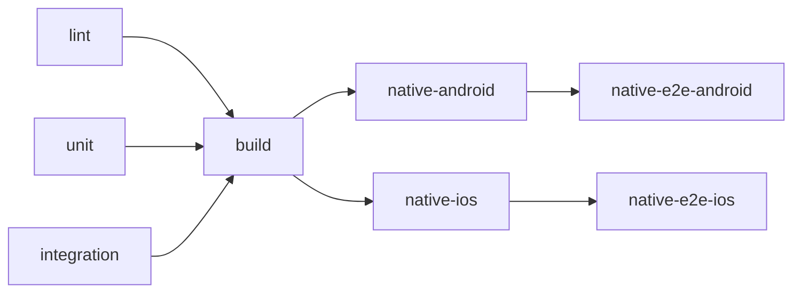

# Native E2E (Maestro)

End-to-end tests run the **demo** Capacitor app on an Android emulator or iOS simulator using [Maestro](https://maestro.mobile.dev/). Local commands and CI use the same scripts under `scripts/e2e/`.

## Layout

```text
e2e/maestro/
  config.yaml       # appId, androidWebViewHierarchy
  shared/           # cross-platform flows (e.g. smoke.yaml)
  android/          # Android-only flows (optional)
  ios/              # iOS-only flows (optional)
```

Keep `appId` aligned with the demo app:

```bash
npm run verify:maestro-app-id
```

## Install Maestro

**macOS (recommended):**

```bash
brew install maestro
```

**Linux / CI (same installer as GitHub Actions):**

```bash
curl -Ls "https://get.maestro.mobile.dev" | bash
export PATH="$HOME/.maestro/bin:$PATH"
```

## Prerequisites

| Platform | Requirements |
|----------|----------------|
| Android | Android SDK, at least one AVD (Android Studio → Device Manager). `ANDROID_HOME` optional if SDK is at `~/Library/Android/sdk` (macOS) |
| iOS | macOS, Xcode, CocoaPods (`brew install cocoapods`) |

Repo root: `npm ci`, Node 20.

## Commands

| Command | Description |
|---------|-------------|
| `npm run e2e:list` | List flow YAML files |
| `npm run e2e:android` | Build demo APK, start emulator if needed, install, run shared flows |
| `npm run e2e:ios` | Build demo `.app`, boot simulator, install, run shared flows |
| `npm run e2e:smoke` | Full pipeline for smoke only (`shared/smoke.yaml`) |
| `npm run e2e` | Android E2E; on macOS also iOS |

Skip native rebuild (app already built):

```bash
node scripts/e2e/run.mjs android --skip-build
node scripts/e2e/run.mjs ios --skip-build
```

### CI-equivalent native build only

```bash
npm run ci:native:android
npm run ci:native:ios
```

### Run Maestro manually (after install)

```bash
# Android (default adb device)
node scripts/e2e/maestro.mjs --platform android

# iOS (must match booted simulator UDID)
DEVICE=$(node scripts/e2e/ios-install.mjs)
node scripts/e2e/maestro.mjs --platform ios --device "$DEVICE"

# Single flow
node scripts/e2e/maestro.mjs --platform android --flow e2e/maestro/shared/smoke.yaml
```

## Android emulator

1. Create an AVD in Android Studio (API 34+ recommended).
2. E2E scripts auto-detect the SDK at `~/Library/Android/sdk` (macOS) or `$ANDROID_HOME` / `$ANDROID_SDK_ROOT`. Optional shell setup:

   ```bash
   export ANDROID_HOME="$HOME/Library/Android/sdk"
   export PATH="$ANDROID_HOME/emulator:$ANDROID_HOME/platform-tools:$PATH"
   ```

3. `npm run e2e:android` starts the first listed AVD if none is booted.
4. Or start manually: `$ANDROID_HOME/emulator/emulator -avd <name>` then `node scripts/e2e/run.mjs android --skip-build`.

## iOS simulator

Simulator selection is deterministic (`scripts/e2e/select-ios-simulator.mjs`):

1. `iPhone 16`
2. `iPhone 15 Pro`
3. `iPhone 15`
4. Newest available iPhone name

Override for local debugging:

```bash
MAESTRO_IOS_DEVICE="iPhone 15 Pro" npm run e2e:ios
```

Maestro always receives `--device <UDID>` for the same simulator used for `simctl install`.

## Debugging failures

| Symptom | What to try |
|---------|-------------|
| Wrong / missing app | `npm run verify:maestro-app-id` |
| Bootstrap timeout | Increase waits in `shared/smoke.yaml`; check device logs |
| Android WebView text not found | `config.yaml` uses `androidWebViewHierarchy: devtools` |
| iOS wrong simulator | Ensure only one booted sim, or set `MAESTRO_IOS_DEVICE` |
| Install failed | Re-run `npm run ci:native:android` / `ci:native:ios` |

**Android logs:**

```bash
adb logcat -d -t 200
```

**Screenshots:** Maestro writes under `~/.maestro/tests` and may leave PNGs under `e2e/maestro/shared/` (gitignored).

## CI behavior



- **`build`** must pass before native assemble jobs (demo web bundle verified).
- **`coverage`**: required on push to `main` / `master` only.
- **`coverage-pr`**: runs on pull requests with `continue-on-error: true` (artifacts only, does not block merge).
- **E2E Android:** `android-emulator-runner` → `scripts/e2e/android-install.mjs` → `scripts/e2e/maestro.mjs`.
- **E2E iOS:** `scripts/e2e/ios-install.mjs` → `scripts/e2e/maestro.mjs --device <UDID>`.

Artifacts: `android-debug-apk`, `ios-simulator-app`, Maestro screenshots `maestro-screenshots-*`.

See also [testing.md](./testing.md) for unit/integration coverage policy.
